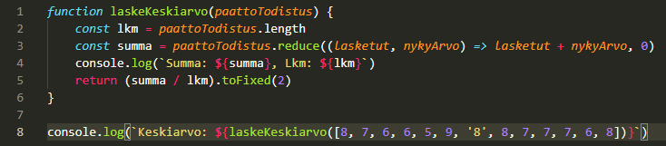
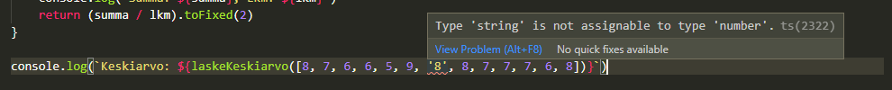

# Esimerkki 1. koulutodistus

Otetaan esimerkki, jossa meillä on funktio laskeKeskiarvo(), joka saa parametrikseen kevättodistuksen arvosanat eli taulukon, jonka alkiot ovat kokonaislukuja ja haluamme funktion palauttavan näiden keskiarvon.

Tältä funktio näyttää JavaScriptillä toteutettuna:
```
function laskeKeskiarvo(paattoTodistus) {
    const lkm = paattoTodistus.length
    const summa = paattoTodistus.reduce((lasketut, nykyArvo) => lasketut + nykyArvo, 0)
    console.log(`Summa: ${summa}, Lkm: ${lkm}`)
    return (summa / lkm).toFixed(2)
}

console.log(`Keskiarvo: ${laskeKeskiarvo([8, 7, 6, 6, 5, 9, 8, 8, 7, 7, 7, 6, 8])}`)
```
Funktio palauttaa ylläolevalla syötteellä seuraavan tulosteen:
```
$ node laskeKeskiarvo.js 
Summa: 92, Lkm: 13
Keskiarvo: 7.08
```
Mitä jos syötettävään taulukkoon olisikin syystä tai toisesta päätynyt merkkijono?

*laskeKeskiarvo.js*
`


Koodi formatoituu oikein, eikä missään näy punaista. Kaikki siis hyvin!
Ajetaan koodi uudestaan

```
node laskeKeskiarvo.js 
Summa: 418877768, Lkm: 13
Keskiarvo: 32221366.77
```
Mielenkiintoista. Ensimmäisten kuuden luvun summa on 41, johon lisätään merkkijono '8'. Kun kokonaislukuun lisätään merkkijono, JavaScript *muuntaa* lopputuloksen merkkijonoksi (ks. [Type coercion](https://developer.mozilla.org/en-US/docs/Glossary/Type_coercion)). Tästä aiheutuu se, että loputkin tähän lisättävät luvut tulee lisätyiksi merkkijonoon, jolloin lopputulos on lopulta 418877768.


Yritetään toisintaa sama TypeScriptillä.

Siirretään sama funktio TypeScript-tiedostoon, mutta määritellään funktion parametreille sekä paluuarvolle tyypit ([toFixed()](https://developer.mozilla.org/en-US/docs/Web/JavaScript/Reference/Global_Objects/Number/toFixed) palauttaa merkkijonon):
```
function laskeKeskiarvo(paattoTodistus: number[]): string {
    const lkm = paattoTodistus.length
    const summa = paattoTodistus.reduce((lasketut, nykyArvo) => lasketut + nykyArvo, 0)
    console.log(`Summa: ${summa}, Lkm: ${lkm}`)
    return (summa / lkm).toFixed(2)
}

console.log(`Keskiarvo: ${laskeKeskiarvo([8, 7, 6, 6, 5, 9, '8', 8, 7, 7, 7, 6, 8])}`)
```
Ajetaan tämä typescriptin node-toteutuksella, [ts-node](https://www.npmjs.com/package/ts-node)lla komennolla `ts-node laskeKeskiarvo.ts`:
```
/mnt/c/Users/oskar/AppData/Roaming/npm/node_modules/ts-node/src/index.ts:500
    return new TSError(diagnosticText, diagnosticCodes)
           ^
TSError: ⨯ Unable to compile TypeScript:
laskeKeskiarvo.ts:8:61 - error TS2322: Type 'string' is not assignable to type 'number'.

8 console.log(`Keskiarvo: ${laskeKeskiarvo([8, 7, 6, 6, 5, 9, '8', 8, 7, 7, 7, 6, 8])}`)
                                                              ~~~

    at createTSError (/mnt/c/Users/oskar/AppData/Roaming/npm/node_modules/ts-node/src/index.ts:500:12)
    at reportTSError (/mnt/c/Users/oskar/AppData/Roaming/npm/node_modules/ts-node/src/index.ts:504:19)
    at getOutput (/mnt/c/Users/oskar/AppData/Roaming/npm/node_modules/ts-node/src/index.ts:739:36)
    at Object.compile (/mnt/c/Users/oskar/AppData/Roaming/npm/node_modules/ts-node/src/index.ts:955:32)
    at Module.m._compile (/mnt/c/Users/oskar/AppData/Roaming/npm/node_modules/ts-node/src/index.ts:1043:43)
    at Module._extensions..js (node:internal/modules/cjs/loader:1121:10)
    at Object.require.extensions.<computed> [as .ts] (/mnt/c/Users/oskar/AppData/Roaming/npm/node_modules/ts-node/src/index.ts:1046:12)
    at Module.load (node:internal/modules/cjs/loader:972:32)
    at Function.Module._load (node:internal/modules/cjs/loader:813:14)
    at Function.executeUserEntryPoint [as runMain] (node:internal/modules/run_main:76:12)
```
Kuten huomataan, tästä aiheutuu virhe eikä sovellus edes väitä toimivansa.

Tämän lisäksi koodia ei VS-Coden Typescript-tuen ansiosta tarvitse edes lähteä ajamaan havaitakseen virheen, vaan virheellisestä tyypistä ilmoitetaan jo editorin tasolla.

*laskeKeskiarvo.ts*


Nyt kun ollaan huomattu virhe ajoissa, voidaan korjata se, ettei myöhemmin tarvitse ihmetellä.
```
ts-node laskeKeskiarvo.ts
Summa: 92, Lkm: 13
Keskiarvo: 7.08
```

## [Edellinen](../0/README.md) | [Seuraava](../2/README.md)
