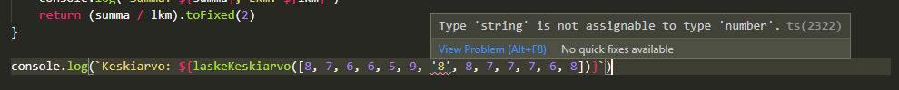

# Esimerkki 2. Tyypit kooditason dokumentaationa ja automaattitäydennysvihjeet

Tässä esimerkissä tarkastellaan tyyppien tuomaa selkeyttä käsiteltäviin tietorakenteisiin ja tyypitetyn koodin itsensä dokumentoivuutta

Esimerkkinä ES6 & Node osuuden 1. oppitunnilta tuttu tehtävä, jossa luetaan tiedot käyttäjistä ja postauksista ja tulostetaan postaukset käyttäjiinsä liitettynä.

Esimerkissä käydään käyttäjien lista läpi ja jokaiselle käyttäjälle tulostetaan postaukset antamalla käyttäjä parametrina funktiolle `printPosts`. Funktion `printPosts` sisällä suodatetaan postausten taulukosta id:n perusteella oikeat postaukset.

```JS
const users = require("./users.json");
const posts = require("./posts.json");

function printPosts(user) {
  posts
    .filter((post) => post.userId === user.id)
    .forEach((post) => console.log(`- ${post.title}`));
}

users.forEach((user) => {
  console.log('\n\n' + user.name);
  printPosts(user)
});
```

Esimerkkitulostus: `node readPrintUsersPosts.js`

```
Clementina DuBuque
- aut amet sed
- ratione ex tenetur perferendis
- beatae soluta recusandae
- qui qui voluptates illo iste minima
- id minus libero illum nam ad officiis
- quaerat velit veniam amet cupiditate aut numquam ut sequi
- quas fugiat ut perspiciatis vero provident
- laboriosam dolor voluptates
- temporibus sit alias delectus eligendi possimus magni
- at nam consequatur ea labore ea harum
```

Meillä on kahdenlaisia olioita: _Käyttäjia_ ja _Postauksia_. Molemmat luetaan jostakin ulkoisesta datalähteestä, tässä tapauksessa JSON-tiedostosta. Tyypillistä olisi, että tiedot haettaisiin jostain ulkoiselta rajapinnalta.

Vaikka tässä tapauksessa koodirivejä on vähän ja on suhteellisen helppoa muistaa, mitä kenttiä JavaScript-olioilla on, projektin koon kasvaessa tämä vaikeutuu ja olioita käsitellessä väärinkirjoitettuihin tai olemattomiin kenttiin viittaamisen riski usein kasvaa. Osoittautuu myös työlääksi pomppia koodissa edestakaisin tarkistamassa, minkä tyyppisistä arvoista mikäkin olio koostuu.

Kirjoitettaessa JavaScriptillä `printPosts`-funktiota täytyy itse tietää minkälaisiin kenttiin voi viitata, sillä funktion saadessa käyttäjän parametrina, funktion sisäisellä näkyvyysalueella meillä ei ole käsitystä, mistä parametrina saatu tieto koostuu.


Tällaisten asioiden muistamista helpottamaan käytetään joskus [JSDoc](https://jsdoc.app/about-getting-started.html)-annotaatioita, esim näin:

```JS
/**
 * @param user Käyttäjä-olio
 * @param user.id Käyttäjän id
 */

function printPosts(user) {
  posts
    .filter((post) => post.userId === user.id)
    .forEach((post) => console.log(`- ${post.title}`));
}
```
Ylläolevassa tavassa on ongelmana se, että refaktoroinnin yhteydessä pitäisi muistaa päivittää myös kommentit. Tämä unohtuu helposti ja on aikaavievää ja työlästä.


Tällaisiin tilanteisiin TypeScript tuo helpotusta. Voimme määritellä käyttäjille ja postauksille omat tyyppinsä esimerkiksi näin:

```TS
type User = {
  id: number;
  name: string;
}

type Post = {
  userId: number;
  id: number;
  title: string;
  body: string;
}
```

Tyypeille on yksinkertaisuuden vuoksi määritelty vain rajattu määrä kenttiä ja niistä esimerkin kannalta oleellisimmat.

Nyt voimme lisätä funktioon `printPosts` tyyppimerkinnät:

```TS
function printPosts(user: User) {
  posts
    .filter((post: Post) => post.userId === user.id)
    .forEach((post: Post) => console.log(`- ${post.title}`));
}
```

Tyyppien määrityksen jälkeen olioita on suhteellisen mukava käsitellä oikeanlaisen tyypityksen puitteissa kehitystyökalujen tarjotessa tarkempia automaattitäydennysvihjeitä.

  
Tiedetään, että käyttäjillä on _number_-tyyppinen kenttä _id_:

  
Ja postauksilla kentät _body, id, title_ ja _userId_

Refaktoroinnin yhteydessä voimme muuttaa vaan tyyppimäärittelyjä ja sama tieto kulkeutuu sinne, missä kyseisen tyyppisiä olioita käytetään. Tyypit voivatkin olla eriytettyinä omiin moduuleihinsa koodissa ja niitä voi hyödyntää projektin eri osissa. 

Näin toteutettuna tyyppitiedon refaktorointi on hyvin suoraviivaista, sillä tyyppiä voidaan muuttaa sieltä missä se on määritelty ja mikäli muutos aiheuttaa virheitä muualla, staattinen koodianalyysi ilmoittaa siitä.

## Huomioitavaa

Tyypin määrittely pelkästään näin ei takaa virheetöntä koodia tai ulkoisesta lähteestä tulleen tiedon oikeellisuutta. Tässä luotetaan siihen, että tiedetään etukäteen missä muodossa data tulee. Näin ei aina kuitenkaan ole ja silloin tiedon ja siitä muodostettavien tyyppien oikeellisuutta on mahdollisuus tarkistaa nk. [_type guard_](https://www.typescriptlang.org/docs/handbook/advanced-types.html#type-guards-and-differentiating-types)eilla, eli funktioilla, jotka tarkastaa, että oliolta löytyy oikeat kentät oikean tyyppisinä ja joiden palautustyyppi on nk. [tyyppipredikaatti](https://www.typescriptlang.org/docs/handbook/2/narrowing.html#using-type-predicates) (eng. _type predicate_)

Tyyppien tarjoamat tukirakenteet sekä niiden hyödyllisyys riippuu myös siitä, kuinka hyvin tai kokonaisvaltaisesti TypeScriptin ominaisuuksia osataan hyödyntää. Tämä vaatii opettelua ja voi tuntua alkuun hieman haastavalta. Eräs mukava puoli ja ero muihin staattisen tyypityksen ominaisuuksia tarjoaviin teknologioihin kuitenkin on se, että tyyppien käyttö on _vapaaehtoista_.

## [Edellinen](../1/README.md) | [Seuraava](../3/README.md)
